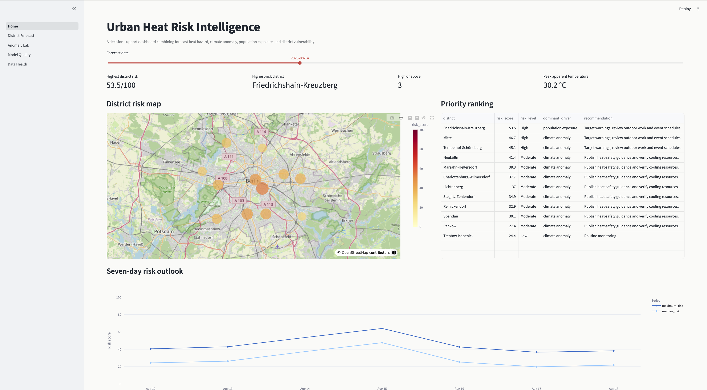

# Urban Heat Risk Intelligence

Urban Heat Risk Intelligence is a data-driven decision-support platform for monitoring short-term heat risk across Berlin’s 12 districts.

The project combines live weather forecasts, historical climate patterns, and district-level demographic and environmental indicators to answer a practical question:

**Where is heat risk likely to be highest over the next seven days, and why?**

Rather than forecasting temperature itself, the system uses Open-Meteo weather forecasts and adds an analytical layer on top. It evaluates how unusual upcoming conditions are compared with the historical climate of each district, then combines weather severity with population exposure and local vulnerability to produce an explainable heat-risk score from **0 to 100**.

The result is presented through an interactive Streamlit dashboard designed for exploration, comparison, and operational awareness.

## Dashboard

### City overview



The main dashboard provides a city-wide view of current and upcoming heat risk, including district rankings, key indicators, a Berlin map, and the seven-day outlook.

### District forecast


Each district can be explored individually to understand how risk develops over the forecast period and which factors are contributing most strongly.

### Scenario simulation


The scenario simulator allows users to explore how changes in weather conditions or vulnerability factors could affect the resulting heat-risk score.

### Anomaly analysis


The anomaly page compares the two detection models, their combined score, and the level of disagreement between them.

## How it works

The system follows two connected workflows: model training and daily forecast scoring.

```text
Historical weather
        │
        ▼
Daily weather features
        │
        ▼
District and monthly climatology
        │
        ▼
Anomaly-detection models
        │
        ▼
Saved models and climate baselines


Current 7-day weather forecast
        │
        ▼
Same daily feature pipeline
        │
        ▼
Anomaly scoring
        │
        ▼
Weather hazard
        +
Population exposure
        +
District vulnerability
        │
        ▼
0–100 heat-risk score
        │
        ▼
Streamlit dashboard
```

Open-Meteo provides the historical and forecast weather data. The models in this repository do **not** attempt to predict future temperature.

Instead, they estimate how unusual forecast conditions are relative to historical conditions for the same district and time of year.

This distinction is important: the project is a **risk-intelligence layer built on top of a weather forecast**, not a weather-forecasting model.

## Data

The platform combines three types of information.

### Weather

Historical and forecast weather is retrieved from Open-Meteo and includes variables such as:

* temperature
* apparent temperature
* relative humidity
* precipitation
* wind speed
* solar radiation

Hourly observations are transformed into daily indicators that better represent heat stress, including:

* maximum temperature
* maximum apparent temperature
* minimum nighttime temperature
* mean humidity
* mean wind speed
* maximum solar radiation
* total precipitation
* hours above 30°C
* hours with apparent temperature above 35°C
* consecutive hot days

The system also derives climate anomalies by comparing conditions with historical values for the same Berlin district and calendar month.

### Demographics

District-level demographic information includes:

* population
* district area
* population density
* population aged 65 and above
* share of residents aged 65 and above

Population density is used as an exposure indicator, while the share of older residents contributes to the vulnerability assessment.

### Environment

Environmental indicators include:

* green-space percentage
* impervious-surface percentage

These variables provide simple proxies for local cooling capacity and urban heat retention.

District reference data is consolidated into:

```text
data/reference/district_profiles.csv
```

## Modeling approach

The project uses two unsupervised anomaly-detection models.

### Isolation Forest

Isolation Forest identifies unusual combinations of weather conditions by measuring how easily observations can be isolated from typical historical patterns.

It can capture unusual combinations involving factors such as apparent temperature, warm nights, humidity, solar radiation, extreme heat hours, and heatwave duration.

### Robust Covariance

Robust Covariance, implemented using `EllipticEnvelope`, estimates the multivariate structure of typical climate conditions while reducing the influence of extreme observations.

It provides a complementary way of identifying observations that lie unusually far from the historical climate distribution.

### Ensemble anomaly score

The raw outputs of both models are converted into historical percentiles so that they can be compared on the same scale.

The final anomaly score combines them as:

```text
70% Isolation Forest
30% Robust Covariance
```

This produces an anomaly score between 0 and 100, where higher values indicate conditions that are more unusual relative to the historical training distribution.

The project also calculates **model disagreement**, which shows how differently the two models assess the same forecast conditions.

## Heat-risk scoring

An unusual weather pattern is not automatically equivalent to high public heat risk.

The project therefore combines three dimensions:

### Hazard

Represents the severity of the weather itself.

It considers factors such as:

* apparent temperature
* warm nighttime temperatures
* duration of hot conditions
* number of extreme heat hours
* climate anomaly score

### Exposure

Represents how many people may be affected.

Population density is currently used as the main exposure proxy.

### Vulnerability

Represents characteristics that may increase sensitivity to heat or reduce local adaptive capacity.

It includes:

* share of residents aged 65+
* impervious surface
* green-space availability

The final score combines the three components:

```text
55% hazard
20% exposure
25% vulnerability
```

The resulting value is normalized to a **0–100 heat-risk score** and translated into an operational category:

| Score  | Risk level |
| ------ | ---------- |
| 0–24   | Low        |
| 25–44  | Moderate   |
| 45–64  | High       |
| 65–81  | Very High  |
| 82–100 | Extreme    |

The scoring system is intentionally transparent. Its purpose is to make it possible to understand why one district receives a higher risk score than another.

## Model evaluation

The anomaly models are evaluated using a chronological holdout rather than a random train/test split.

Earlier historical observations are used for training, while the final year is kept separate for evaluation. This better reflects the real deployment setting, where models are trained on past observations and applied to future conditions.

Because the project does not include hospital admissions, mortality, ambulance calls, or other health-outcome labels, model evaluation uses a climate-extreme proxy based on historical high-temperature and warm-night thresholds.

The ensemble currently achieves strong performance on this benchmark, with detailed results stored in:

```text
artifacts/model_metrics.json
```

The evaluation should therefore be interpreted as:

**How well does the system identify historically extreme weather conditions?**

It should not be interpreted as:

**How accurately does the system predict illness, mortality, or emergency-service demand?**

More detail on the assumptions and evaluation methodology is available in:

```text
docs/model_card.md
```

## Application

The Streamlit application contains several views designed for different levels of analysis.

**Executive overview** provides the city-wide situation, district ranking, headline indicators, Berlin map, and seven-day outlook.

**District Forecast** provides a detailed view of an individual district, including its forecast trajectory and risk decomposition.

**Scenario Simulator** allows selected inputs to be adjusted to explore how different conditions would affect heat risk.

**Anomaly Lab** compares Isolation Forest, Robust Covariance, the ensemble anomaly score, and model disagreement.

**Model Quality** presents evaluation results and explains the limitations of the proxy-label approach.

**Data Health** monitors data freshness, district coverage, validation results, and pipeline status.

## Project structure

```text
urban-heat-risk-intelligence/
│
├── .github/
│   └── workflows/
│       ├── ci.yml
│       └── refresh.yml
│
├── app/
│   ├── Home.py
│   └── pages/
│
├── artifacts/
│   ├── anomaly_models.joblib
│   └── model_metrics.json
│
├── configs/
│   └── settings.json
│
├── data/
│   ├── processed/
│   ├── reference/
│   └── raw/
│
├── docs/
│
├── scripts/
│   ├── build_district_profiles.py
│   ├── validate_district_profiles.py
│   ├── train_models.py
│   └── refresh_forecast.py
│
├── src/
│   └── urban_heat_risk/
│       ├── data/
│       ├── features/
│       ├── models/
│       ├── pipelines/
│       └── risk/
│
├── tests/
├── pyproject.toml
├── requirements.txt
└── README.md
```

The main responsibilities are separated intentionally:

```text
data/        → data access, validation, and reference datasets
features/    → hourly-to-daily transformation and climatology
models/      → anomaly detection and model evaluation
risk/        → hazard, exposure, vulnerability, and final score
pipelines/   → orchestration of training and forecast refresh
app/         → Streamlit user interface
tests/       → automated tests
```

## Running the project locally

Create and activate a virtual environment:

```bash
python -m venv .venv
source .venv/bin/activate
```

On Windows:

```bash
.venv\Scripts\activate
```

Install the project and development dependencies:

```bash
python -m pip install --upgrade pip
python -m pip install -e ".[dev]"
```

### Train with live historical weather

```bash
python scripts/train_models.py --mode live
```

This retrieves historical weather, creates daily features and climatology, trains the anomaly-detection models, evaluates them, and stores the resulting artifacts.

### Refresh the latest forecast

```bash
python scripts/refresh_forecast.py --mode live
```

This retrieves the latest Open-Meteo forecast, creates forecast features, scores anomalies, calculates district heat risk, and updates the processed dashboard outputs.

### Launch the application

```bash
python -m streamlit run app/Home.py
```

## Offline demo

A deterministic demo mode is also included so that the complete pipeline can be explored without relying on an external weather API.

```bash
make demo
make app
```

The demo generates synthetic historical and forecast data, trains the models, creates risk outputs, and launches the same dashboard structure.

Synthetic demo results are clearly separated from official or live district evidence.

## Data sources

Weather data is provided by [Open-Meteo](https://open-meteo.com/).

Berlin demographic and environmental reference data is based on publicly available information from sources including:

* [Amt für Statistik Berlin-Brandenburg](https://www.statistik-berlin-brandenburg.de/)
* [Berlin Open Data](https://daten.berlin.de/datensaetze)
* [Berlin Environmental Atlas](https://www.berlin.de/umweltatlas/)

Open-Meteo documentation:

* [Historical Weather API](https://open-meteo.com/en/docs/historical-weather-api)
* [Forecast API](https://open-meteo.com/en/docs)
* [About and licensing](https://open-meteo.com/en/about)

## Data quality and validation

The project performs validation throughout the pipeline rather than assuming that incoming data is correct.

Checks include:

* required columns
* missing values
* duplicate observations
* expected district coverage
* weather-variable ranges
* date coverage
* forecast freshness

Pipeline health information is written to:

```text
data/processed/data_health.json
```

and surfaced directly in the Streamlit application.

## Automation

Two GitHub Actions workflows support the project.

`ci.yml` runs automated quality checks such as:

```text
Ruff linting
Ruff formatting
pytest
dependency validation
```

`refresh.yml` performs the scheduled forecast refresh.

The refresh workflow retrieves the latest forecast, recalculates district-level risk, and commits the refreshed outputs back to the repository so that the deployed Streamlit application can display the latest available results.

## Main commands

```bash
make install
make demo
make train
make refresh
make app
make test
make lint
```

Equivalent Python commands can also be run directly from the `scripts/` directory.

## Limitations

This project is designed as a heat-risk intelligence and decision-support system, not as a clinical or epidemiological prediction model.

Several limitations are important:

* Weather forecasts contain uncertainty and can change between refreshes.
* District-level indicators simplify substantial variation within individual districts.
* Representative district coordinates do not capture every local microclimate.
* Green space and impervious surface are proxies for urban environmental conditions.
* The anomaly models detect unusual weather rather than health outcomes.
* The risk weights are transparent analytical assumptions rather than coefficients estimated from observed health impacts.

These limitations are intentional and documented so that the outputs are interpreted appropriately.

## Future development

Possible extensions include:

* finer spatial analysis using Berlin district or LOR polygons
* population-weighted or gridded weather inputs
* additional urban-form and satellite indicators
* wet-bulb temperature or WBGT-style heat-stress features
* forecast uncertainty from ensemble weather models
* archived forecast backtesting
* longer-term model and data drift monitoring
* integration of emergency calls, hospital activity, energy demand, or other operational outcomes where suitable data is available

## Purpose

Urban Heat Risk Intelligence demonstrates how weather data, unsupervised machine learning, spatial vulnerability indicators, automated pipelines, and an interactive application can be combined into a practical end-to-end analytics product.

The emphasis is not only on building a model, but on building the surrounding system needed to make its outputs understandable, reproducible, testable, and usable.
