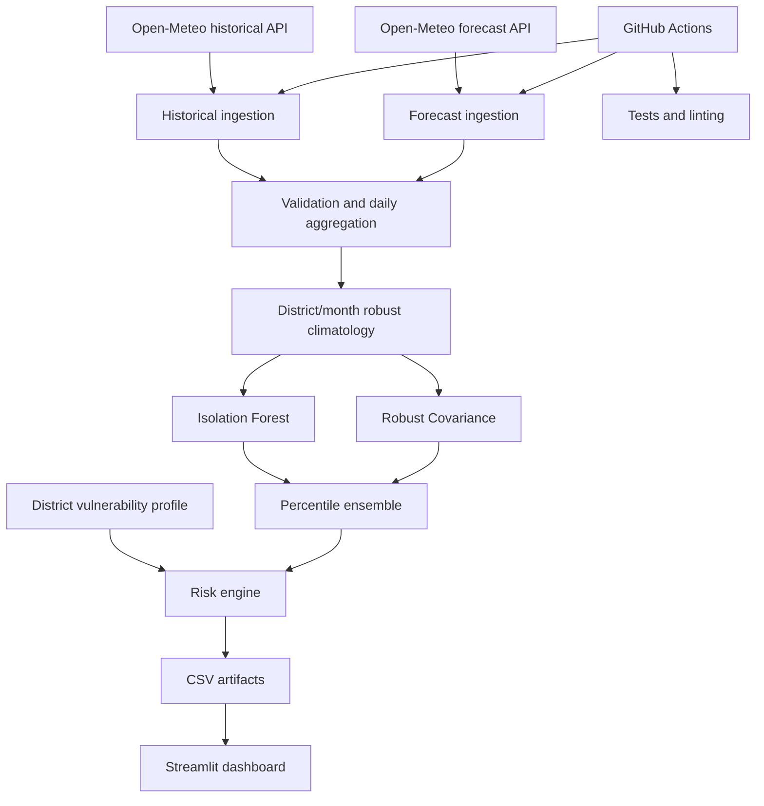

# Architecture

## System context

The platform is a batch-oriented decision-support product. It does not need a continuously running backend for the portfolio version. A scheduled workflow refreshes forecast data and materializes a small dashboard table that Streamlit reads efficiently.

## Batch contracts

### Training pipeline

Input:

- Historical hourly weather
- District profile reference table
- Runtime settings

Output:

- `artifacts/anomaly_models.joblib`
- `artifacts/model_metrics.json`
- `data/processed/historical_daily.csv`

### Refresh pipeline

Input:

- Trained model bundle and climatology
- Recent past and future hourly forecast weather
- District profile table

Output:

- `data/processed/forecast_daily.csv`
- `data/processed/latest_risk.csv`
- `data/processed/data_health.json`

## Design choices

### Materialized outputs instead of online inference

The data volume is small and the forecast changes on a batch cadence. Precomputing outputs reduces Streamlit startup time, avoids repeated API calls from viewers, and provides auditable snapshots.

### Median/MAD climatology

Mean and standard deviation can be distorted by heat extremes. District/month median and median absolute deviation provide a robust seasonal baseline.

### Two anomaly models

Isolation Forest provides a global partitioning view. Robust Covariance provides a complementary robust-distance view of the multivariate climate envelope. The ensemble works on empirical percentiles so the scores are comparable despite different native scales.

### Transparent risk engine

Without real impact labels, a learned risk score would give false precision. The final score is therefore an explicit, documented weighted index. The unsupervised models influence the hazard component only.
